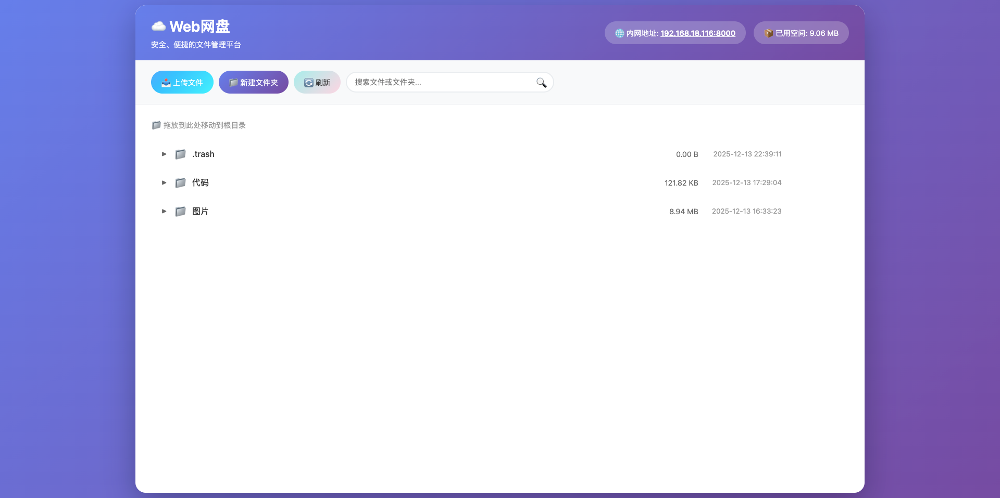

# Web网盘

一个功能完整、界面美观的Web网盘应用，基于Flask开发，支持文件和文件夹的完整管理功能，支持局域网访问。



## ✨ 功能特性

### 📁 文件管理
- ✅ **文件上传**：支持拖拽上传、点击上传、批量上传
- ✅ **文件下载**：支持中文文件名，自动处理编码
- ✅ **文件删除**：支持撤销删除（最多5步），按 `Ctrl+Z` 撤销
- ✅ **文件预览**：支持图片、文本、PDF、视频、音频等文件预览
- ✅ **文件搜索**：实时搜索，支持文件名和路径搜索，匹配文字高亮显示
- ✅ **上传进度条**：实时显示上传进度
- ✅ **PDF转JPG**：右键PDF文件可批量导出为JPG图片并打包为ZIP下载
- ✅ **图片缩略图**：图片文件在文件列表中显示缩略图预览

### 📂 文件夹管理
- ✅ **创建文件夹**：支持在任意位置创建文件夹
- ✅ **文件夹树状展示**：树状结构，支持折叠/展开
- ✅ **文件夹排序**：按文件名自动排序
- ✅ **文件夹拖拽**：支持拖拽移动文件夹
- ✅ **点击展开**：点击文件夹名称或箭头按钮展开/收起

### 🎯 高级功能
- ✅ **拖拽移动**：支持拖拽文件/文件夹到目标位置
- ✅ **右键菜单**：丰富的右键菜单功能
  - 新建文件/文件夹
  - 重命名
  - 移动
  - 删除
  - 恢复（回收站中）
  - 永久删除（回收站中）
  - 清空回收站
  - 编辑图片（图片文件）
  - 导出为JPG（PDF文件）
- ✅ **图像编辑**：强大的在线图像编辑功能
  - **裁剪**：支持自由裁剪和固定比例裁剪（1:1、16:9、4:3）
  - **透视变换**：通过4个点进行图像透视变换
  - **文字标注**：添加文字，支持颜色、字体、字号选择，可拖拽移动
  - **箭头标注**：添加箭头，支持类型（简单、实心、双箭头）、颜色、大小选择
  - **画笔工具**：涂抹工具，支持自定义颜色和粗细（3档预设）
  - **撤销/重做**：支持最多10步操作历史，`Ctrl+Z` 撤销，`Ctrl+Shift+Z` 重做
  - **保存编辑**：编辑后的图片保存为新文件，不覆盖原图
- ✅ **回收站功能**：
  - 删除的文件自动进入回收站
  - 支持恢复单个或批量恢复
  - 支持永久删除
  - 显示原始文件名
- ✅ **文件搜索**：
  - 实时搜索文件和文件夹
  - 点击搜索结果自动定位
  - 自动展开路径上的所有文件夹
  - 匹配文字红色高亮显示
- ✅ **存储统计**：实时显示已用存储空间
- ✅ **服务器信息**：显示内网IP地址，一键复制

### 🎨 界面特性
- ✅ **现代化UI**：渐变配色、卡片式设计、流畅动画
- ✅ **响应式设计**：完美适配手机、平板、电脑
- ✅ **中文支持**：完整支持中文文件名和文件夹名
- ✅ **键盘快捷键**：
  - `Ctrl+Z` / `Cmd+Z`：撤销删除
  - `Enter`：确认操作（创建、重命名等）

## 🚀 快速开始

### 环境要求

- Python 3.6+
- pipenv
- poppler-utils (用于PDF转JPG功能)
  - macOS: `brew install poppler`
  - Ubuntu/Debian: `sudo apt-get install poppler-utils`
  - Windows: 下载并安装 [poppler for Windows](http://blog.alivate.com.au/poppler-windows/)

### 安装步骤

1. **安装poppler**（如果使用PDF转JPG功能，必须先安装）：
   
   **方式1 - Homebrew (推荐，macOS)**:
   ```bash
   brew install poppler
   ```
   安装后验证：
   ```bash
   brew list poppler
   which pdftoppm
   ```
   
   **方式2 - Conda (如果使用conda环境)**:
   ```bash
   conda install -c conda-forge poppler
   ```
   安装后验证：
   ```bash
   conda list poppler
   which pdftoppm
   ```
   
   **其他系统**:
   - Ubuntu/Debian: `sudo apt-get install poppler-utils`
   - Windows: 下载并安装 [poppler for Windows](http://blog.alivate.com.au/poppler-windows/)，并确保添加到系统PATH中
   
   **重要提示**：
   - 安装后必须重启应用才能生效
   - 如果使用pipenv，请确保在 `pipenv run` 环境中运行应用
   - 如果仍无法找到，请检查PATH环境变量是否包含poppler的bin目录

2. **安装pipenv**（如果未安装）：
```bash
pip install pipenv
```

3. **使用指定的Python解释器安装依赖**：
```bash
pipenv install --python /path/to/python
```

或者使用系统Python：
```bash
pipenv install --python 3.10
```

4. **激活虚拟环境**（可选）：
```bash
pipenv shell
```

### 运行应用

**重要**：所有命令都需要在 `pipenv run` 环境中运行，或者在激活的虚拟环境中运行。

1. **启动应用**（推荐使用pipenv run）：
```bash
pipenv run python app.py
```

或者先激活虚拟环境：
```bash
pipenv shell
python app.py
```

2. **访问应用**：
   - 本地访问：http://127.0.0.1:8000
   - 局域网访问：http://<你的IP地址>:8000

启动后，终端会显示具体的访问地址，页面顶部也会显示内网地址。

## 📁 项目结构

```
clouddisk/
├── app.py              # Flask应用主文件（路由和主要逻辑）
├── config.py           # 配置文件（所有配置项集中管理）
├── Pipfile             # pipenv依赖配置
├── Pipfile.lock        # 依赖锁定文件（自动生成）
├── requirements.txt    # 依赖列表
├── src/                # 源代码模块
│   ├── __init__.py     # 模块初始化
│   ├── utils.py        # 工具函数（文件名处理、大小格式化等）
│   ├── path_utils.py   # 路径处理工具
│   ├── file_info.py    # 文件信息获取
│   ├── file_tree.py    # 文件树构建
│   ├── search.py       # 文件搜索功能
│   ├── trash.py        # 回收站管理
│   └── pdf_utils.py    # PDF处理工具
├── templates/          # HTML模板目录
│   └── index.html      # 主页面
├── static/             # 静态资源目录
│   ├── css/            # CSS样式文件
│   │   └── main.css    # 主样式文件
│   ├── js/             # JavaScript文件
│   │   └── main.js     # 主脚本文件
│   └── image/          # 图片资源
│       └── demo.png    # 演示图片
├── uploads/            # 文件上传目录（自动创建）
│   └── .trash/         # 回收站目录（自动创建）
└── README.md           # 项目说明文档
```

## ⚙️ 配置说明

所有配置项都在 `config.py` 文件中，可以根据需要修改：

### 服务器配置
- **HOST**：服务器监听地址，默认 `'0.0.0.0'`（支持局域网访问）
- **PORT**：服务端口，默认 `8000`
- **DEBUG**：调试模式，默认 `True`（生产环境建议设置为 `False`）

### 文件管理配置
- **UPLOAD_FOLDER**：文件上传目录，默认 `'uploads'`
- **MAX_CONTENT_LENGTH**：最大上传文件大小（字节），默认 `1GB`
  - 100MB：`100 * 1024 * 1024`
  - 500MB：`500 * 1024 * 1024`
  - 2GB：`2 * 1024 * 1024 * 1024`

### 安全配置
- **SECRET_KEY**：Flask会话密钥，生产环境请务必修改

### 文件类型限制
- **ALLOWED_EXTENSIONS**：允许的文件扩展名集合
  - 空集合 `set()` 表示允许所有文件类型
  - 限制特定类型：`{'txt', 'pdf', 'png', 'jpg', 'jpeg', 'gif', 'doc', 'docx'}`

修改配置后，重启应用即可生效。

## 📖 使用指南

### 文件操作

#### 上传文件
1. **拖拽上传**：直接将文件拖拽到上传区域
2. **点击上传**：点击"上传文件"按钮，选择文件
3. **上传到指定文件夹**：在上传对话框中选择目标文件夹
4. **批量上传**：支持一次选择多个文件上传

#### 下载文件
- 点击文件行的"下载"按钮
- 或右键文件选择"下载"

#### 删除文件
- 点击文件行的"删除"按钮
- 或右键文件选择"删除"
- 删除后可按 `Ctrl+Z` 撤销（最多5步）

#### 预览文件
- 点击文件行的"预览"按钮
- 支持预览：图片、文本、PDF、视频、音频

### 文件夹操作

#### 创建文件夹
1. 点击工具栏"新建文件夹"按钮
2. 或右键空白区域/文件夹选择"新建文件夹"
3. 输入文件夹名称，按 `Enter` 确认

#### 展开/收起文件夹
- 点击文件夹前的箭头按钮
- 或直接点击文件夹名称

#### 移动文件/文件夹
1. **拖拽移动**：拖拽文件/文件夹到目标文件夹
2. **右键移动**：右键选择"移动"，选择目标位置

### 搜索功能

1. 在顶部搜索框输入关键词
2. 实时显示匹配结果
3. 匹配的文字会红色高亮显示
4. 点击搜索结果自动定位到文件位置
5. 自动展开路径上的所有文件夹

### 回收站功能

#### 恢复文件
- 右键回收站中的文件选择"恢复"
- 或右键`.trash`文件夹选择"一键恢复"

#### 永久删除
- 右键回收站中的文件选择"永久删除"
- 或右键`.trash`文件夹选择"清空回收站"

### 右键菜单

#### 在文件上右键
- 新建文件
- 重命名
- 移动
- 删除
- 编辑图片（仅图片文件）
- 导出为JPG（仅PDF文件）

#### 在文件夹上右键
- 新建文件
- 新建文件夹
- 重命名
- 移动
- 删除

#### 在回收站文件夹上右键
- 一键恢复
- 清空回收站

#### 在回收站中的文件上右键
- 恢复
- 永久删除

### 图像编辑功能

右键点击图片文件，选择"编辑图片"即可进入图像编辑器。

#### 裁剪功能
1. 点击"裁剪"工具
2. 在图片上拖拽选择裁剪区域
3. 支持固定比例裁剪：选择 1:1、16:9 或 4:3
4. 按 `Enter` 确认裁剪，或点击"应用裁剪"按钮
5. 点击"取消"放弃裁剪

#### 透视变换
1. 点击"透视变换"工具
2. 依次点击图片上的4个点（按顺序：左上、右上、右下、左下）
3. 选点过程中会显示当前选中的范围
4. 选完4个点后，按 `Enter` 确认变换，或按 `Esc` 退出
5. 点击"应用变换"或"取消"按钮

#### 文字标注
1. 点击"文字"工具
2. 在图片上点击要添加文字的位置
3. 输入文字内容，选择颜色、字体、字号
4. 按 `Enter` 确认
5. 点击已添加的文字可以选中并拖拽移动
6. 选中文字后可以重新编辑内容

#### 箭头标注
1. 点击"箭头"工具
2. 选择箭头类型（简单、实心、双箭头）
3. 选择颜色和大小（通过实心圆大小选择）
4. 在图片上拖拽绘制箭头

#### 画笔工具
1. 点击"涂抹"工具
2. 选择画笔颜色和粗细（通过实心圆大小选择：小、中、大）
3. 在图片上按住鼠标拖动进行涂抹
4. 支持连续涂抹，实时显示效果

#### 撤销/重做
- `Ctrl+Z` / `Cmd+Z`：撤销上一步操作（最多10步）
- `Ctrl+Shift+Z` / `Cmd+Shift+Z`：重做操作

#### 保存编辑
- 点击"保存"按钮保存编辑后的图片
- 编辑后的图片会保存为新文件，不会覆盖原图
- 文件名格式：`原文件名_编辑时间戳.扩展名`

#### 其他操作
- **重置**：重置所有编辑，恢复到原始图片
- **退出**：关闭图像编辑器
- **取消**：取消当前操作（裁剪、透视变换等）

### 键盘快捷键

- `Ctrl+Z` / `Cmd+Z`：撤销删除操作（文件管理）或撤销编辑操作（图像编辑）
- `Ctrl+Shift+Z` / `Cmd+Shift+Z`：重做操作（图像编辑）
- `Enter`：确认操作（创建文件/文件夹、重命名、裁剪、透视变换等）
- `Esc`：退出当前操作（裁剪、透视变换等）

## 🔒 安全特性

- ✅ 路径安全验证，防止路径遍历攻击
- ✅ 文件名安全处理，支持中文
- ✅ 移动操作安全检查（不能移动到自己的子文件夹）
- ✅ 删除文件先进入回收站，可恢复
- ✅ 支持文件类型限制配置

## ⚠️ 注意事项

1. 首次运行会自动创建`uploads/`目录用于存储上传的文件
2. 删除的文件会先进入`.trash/`回收站，可以恢复
3. 支持所有文件类型上传（可在配置中限制）
4. 确保防火墙允许配置端口的访问，以便局域网内其他设备访问
5. 回收站中的文件会显示原始文件名
6. 搜索功能支持中文搜索

## 🔐 安全提示

⚠️ 这是一个功能完整的网盘应用，适合在受信任的局域网内使用。在生产环境使用前，请考虑添加：

- 用户认证和授权
- 文件类型限制
- 更严格的安全措施
- HTTPS支持
- 访问日志记录
- 文件大小和数量限制

## 🛠️ 技术栈

- **后端**：Flask (Python)
  - 模块化设计，代码结构清晰
  - `src/` 目录包含工具函数、文件处理、搜索、PDF处理等模块
  - 支持图像编辑和保存
- **前端**：HTML5 + CSS3 + JavaScript (原生)
  - CSS和JS代码分离到独立文件
  - 响应式设计，支持移动端
  - Canvas API 实现图像编辑功能
  - 支持拖拽、右键菜单、键盘快捷键
- **依赖管理**：pipenv
- **文件存储**：本地文件系统
- **图像处理**：前端 Canvas API，后端 Pillow（PDF转图片）

## 📝 更新日志

### v1.1.0
- ✅ **图像编辑功能**：强大的在线图像编辑器
  - 裁剪功能（支持固定比例：1:1、16:9、4:3）
  - 透视变换（4点透视变换）
  - 文字标注（可拖拽移动，支持颜色、字体、字号选择）
  - 箭头标注（多种类型：简单、实心、双箭头）
  - 画笔工具（自定义颜色和粗细，3档预设大小）
  - 撤销/重做（最多10步操作历史）
  - 保存为新文件，不覆盖原图
- ✅ **图片缩略图**：文件列表中图片文件显示缩略图预览
- ✅ **UI优化**：图像编辑工具界面优化，单选框使用实心圆显示大小

### v1.0.0
- ✅ 完整的文件和文件夹管理功能
- ✅ 拖拽上传和移动
- ✅ 文件搜索和定位
- ✅ 回收站功能
- ✅ 右键菜单
- ✅ 响应式设计
- ✅ 中文支持
- ✅ 代码模块化重构
  - 后端代码按功能拆分到 `src/` 模块
  - 前端CSS和JS代码分离到独立文件
  - 代码结构更清晰，便于维护和扩展

## 📄 许可证

MIT License

## 🤝 贡献

欢迎提交 Issue 和 Pull Request！

## 📧 联系方式

如有问题或建议，欢迎反馈。
